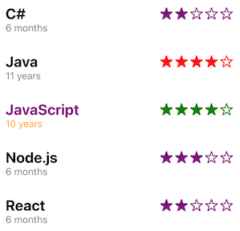

# reactjs-rating-component

> A rating component built using React.js

[](https://www.npmjs.com/package/reactjs-rating-component) [](https://standardjs.com)

## Install

```bash
npm install --save reactjs-rating-component
```

## Usage

```jsx
import React, { Component } from 'react'

import RatingComponent from 'reactjs-rating-component'

class Example extends Component {
  render() {
    return <>
        <RatingComponent heading="C#" subheading="6 months" rate="2" starColor="purple" />
        <RatingComponent heading="Java" subheading="11 years" rate="4" />
        <RatingComponent heading="JavaScript" subheading="10 years" rate="4" headingColor='purple' subheadingColor='orange' starColor="green" />
        <RatingComponent heading="Node.js" subheading="6 months" rate="3" starColor="purple" />
        <RatingComponent heading="React" subheading="6 months" rate="2" headingColor='#FF0000' subheadingColor='#00FF00' starColor="#0000FF" />
    </>
  }
}
```



## License

MIT © [adafycheng](https://github.com/adafycheng)
